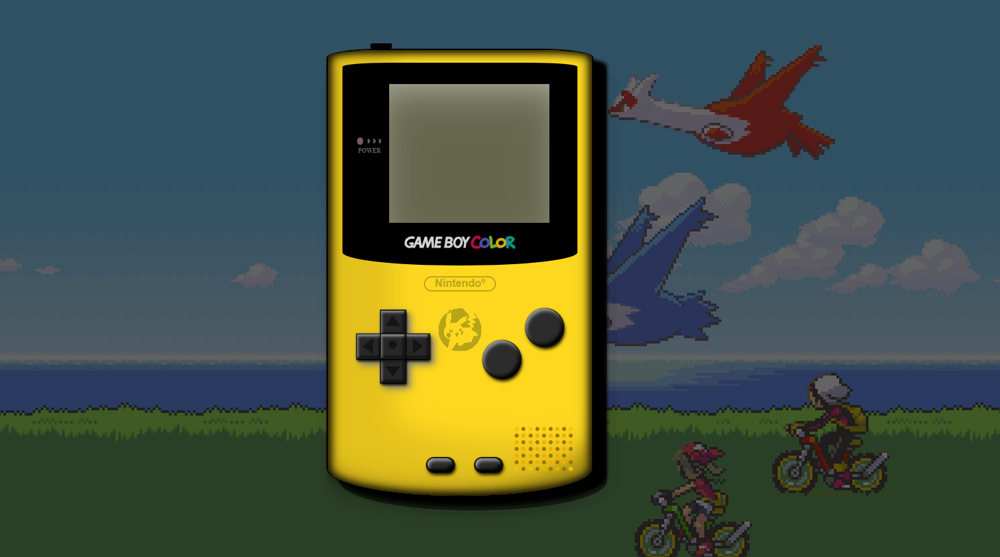
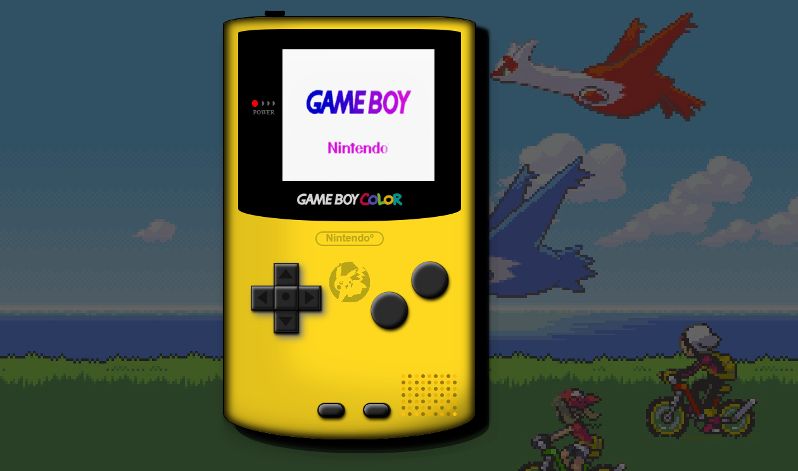
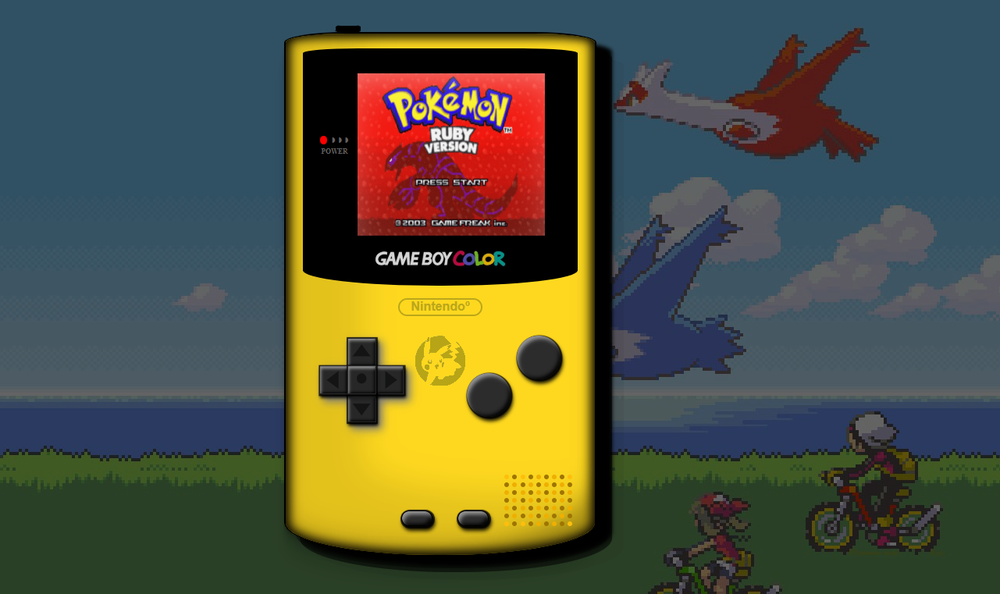
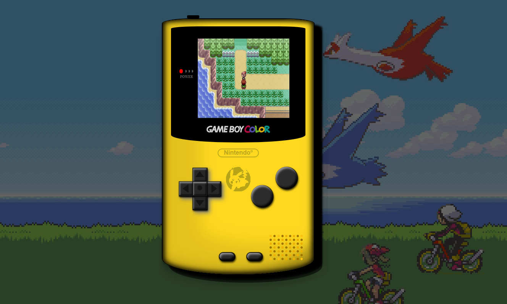

<h1 align="center">✦ GAMEBOY COLOR ✦

## Proyecto 2 - Consola.

#### ↠ Se trata de una Gameboy Color con la que se puede interactuar pulsando los siguientes botones:

### ✦ POWER: 

#### ↠ La consola enciende y la luz de power se enciende también. En la pantalla se muestra el logo de Gameboy y Nintendo.

### ✦ START: 

#### ↠ Se incia el juego de "Pokemon Ruby" mostrando una pantalla con el mensaje de "press start".

### ✦ BOTON A: 

#### ↠ Con el botón A se inicia el juego.

### ✦ SELECT: 

#### ↠ Con el botón SELECT la pantalla se apaga, también se apaga el LED de encendido y vuelve todo a su estado base.

## TECNOLOGÍAS UTILIZADAS:

#### ↠ HTML
#### ↠ CSS
#### ↠ JS

